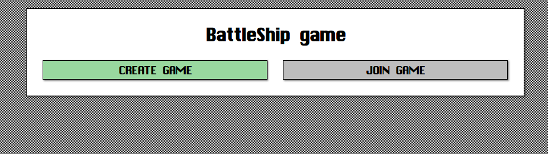
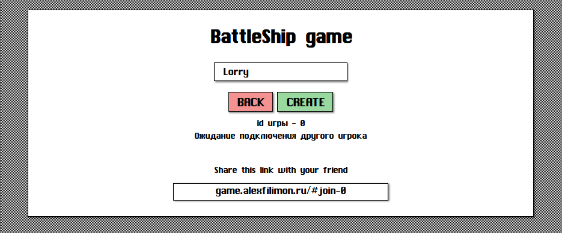
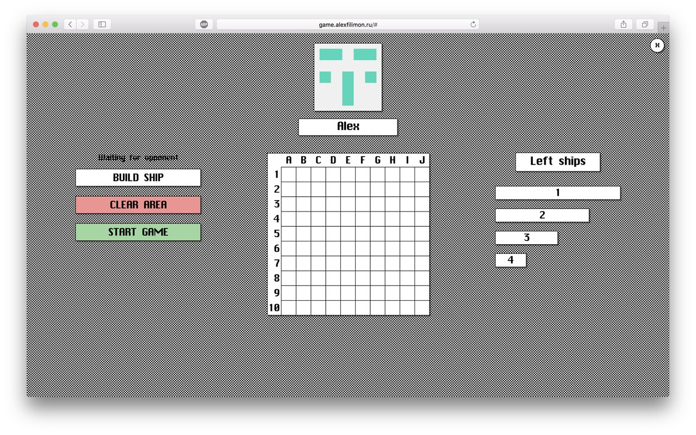
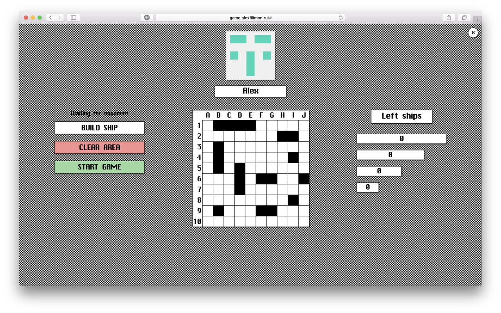
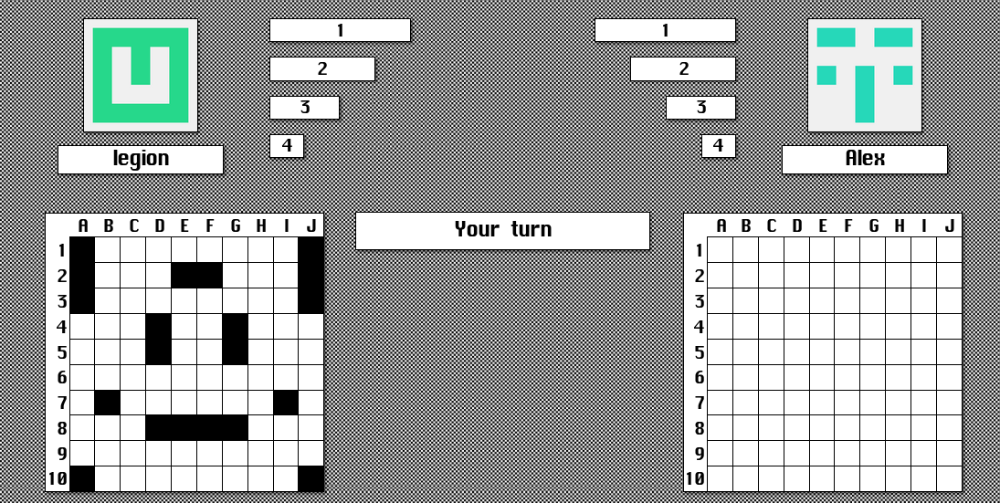
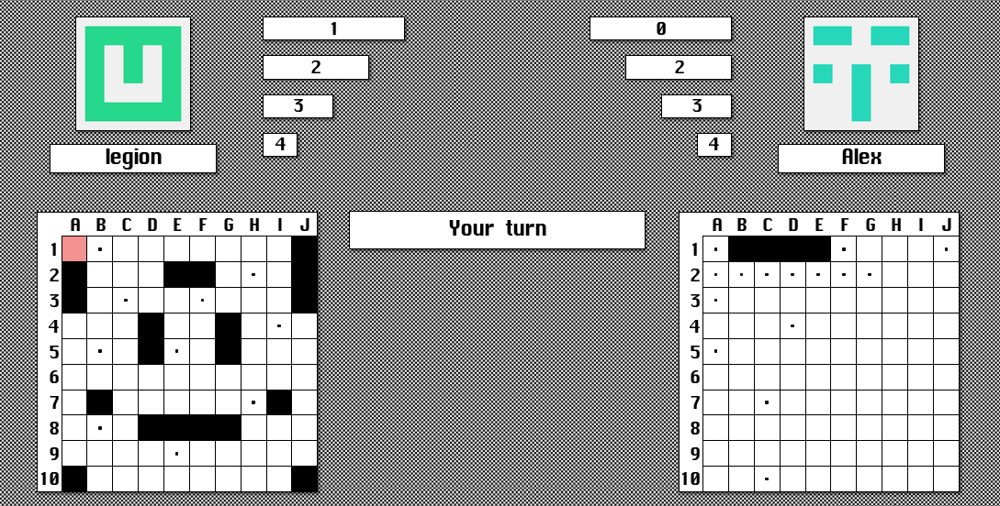
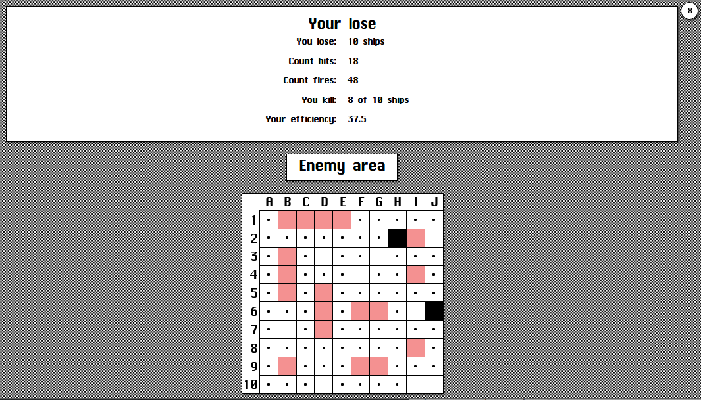

# BattleShip
The classic wide-known game recreated using duo of `Python` and `JavaScript`

You can play it now with your friend [here](http://game.alexfilimon.ru/) 

## Demo
_Initial screen_

### _Creating new game_

You can share inviting link with your friend

### _Setting up ships_

It's easy to set your ship up - just click a cell and then drag your mouse until you are drawing the ship. Then you can click `Build ship` button or use shortcut `Ctrl+G`.
On the right side of screen you can see amount of ships you haven't setted yet

Finally just click `Start game` and wait until another gamer has  setted ships up.

### _Battle screen_

When your cell is hitted, it colours red. 
And if you kill a ship, there are dots around it that means that the ships is killed and there are no cells to be fired.
At the top of the screen you can see yours and your enemys's ships remaining.

The game stops when a player  has fired all enemys' ships. 
If you have at least one not bitten cell, you are the winner!